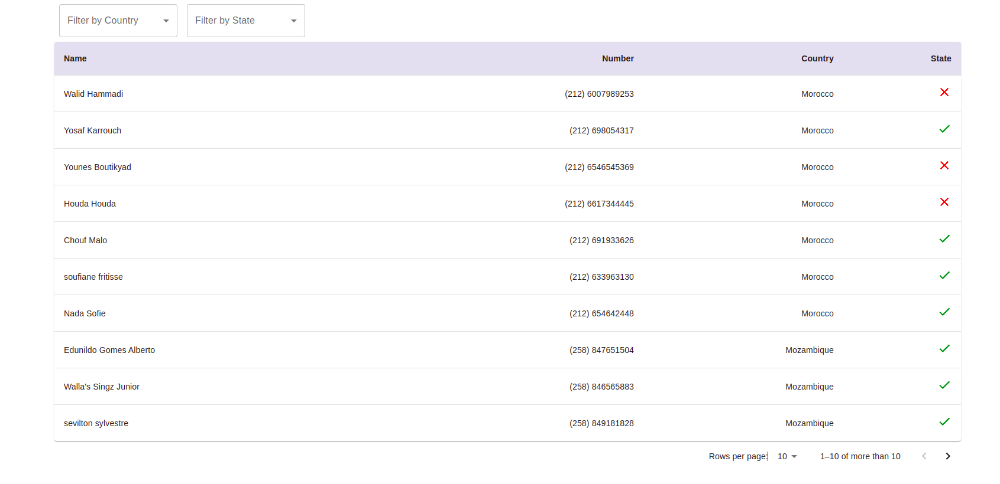
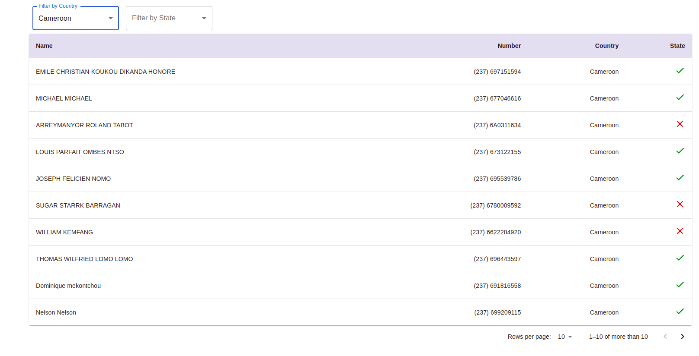
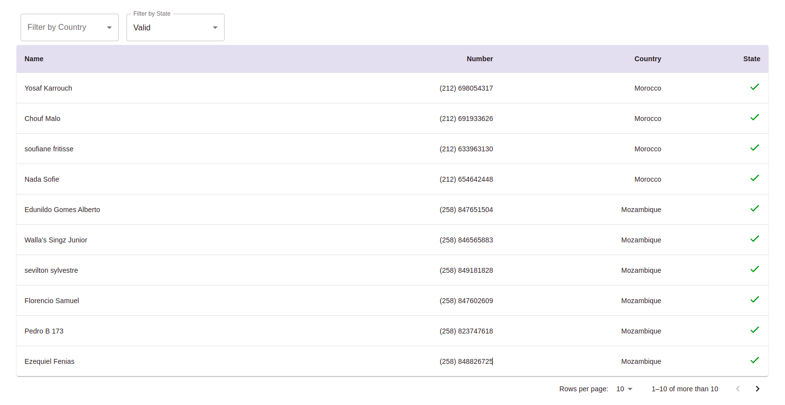
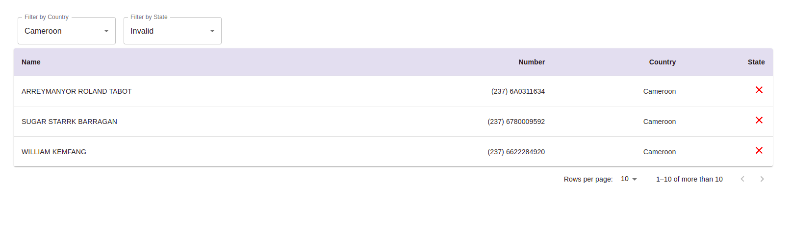

# jpay-assignment

A single page application that shows customers info such as their name, phone number, country and state(valid or not valid).

## requirements

* Create API to get all customers.
* Create API to get customers filtering by country or state or both of them.
* Add unit test for services.
* Dockerize the application.
* Implement Pagination(bonus).
* Add API documentation (Additional).

## Technologies

* Backend: Java (Spring Boot)
* Frontend: react


## Some staff we can add on the future

* Adding authentication and Authorization
* Adding feature flags
* Adding logs
* Adding functional tests
* Adding testing cycle into CI using github actions

## How to run the application

1. Clone the project
   ```sh
   git clone https://github.com/mohamednabil00000/jpay-assignment.git
   ```
2. Move to /jpay-assignment and run
   ```sh
   $ docker-compose build
   $ docker-compose up

3. The application is now running and can be accessed through
   ```sh
   http://localhost:3000/

## API Documentation
   ```sh
   http://localhost:8083/swagger-ui.html
   ```
## Run samples

* All data
 
 
* Filter by Country
 
  
* Filter by State
  
  
* Filter by Country and State
  
  
 
